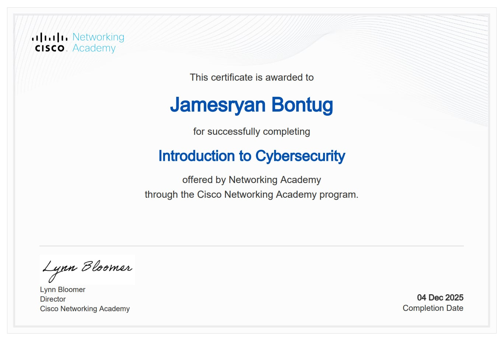

# My Portfolio


## Overview

This is my personal portfolio website showcasing my skills, education, certificates, projects, and contact information.  
Built with **HTML5, CSS3, JavaScript, and Figma** for design references.

---

## Sections

### Home
Welcome message and my professional title.

**Screenshot:**


---

### About Me
A brief description of who I am, my skills, and education.

**Name:** James Ryan D. Bontug  
**Profile Image:** `ryan.jpg`  
**Education:** Bachelor of Science in Information Technology, St. John Paul II College of Davao (2025 - 2026)

**Skills:**
- HTML5
- CSS3
- JavaScript

**Screenshot:**


---

### Certificates
Showcase of my certifications.

**Certificate Example:**
- Introduction to Cybersecurity, Cisco Networking Academy, 04 Dec 2025  

**Screenshot:**


---

### Projects
Personal projects that demonstrate my skills.  

**Portfolio Website** – Personal portfolio with modern design.  
Technologies used: HTML, CSS, JavaScript, Figma

**Screenshot:**


> Clicking "View Project" in the live portfolio displays the project image `project.png`.

---

### Contact
Ways to get in touch with me.

**Email:** jamesryan_bontug@sjp2cd.edu.ph  
**Phone:** +63 985 538 2593  
**Location:** Davao, Philippines  

**Socials:**  
- [Facebook](https://www.facebook.com/ryanjames252)  
- [GitHub](https://github.com/ryanjamesz252)  
- [Instagram](https://www.instagram.com/ryanjamesz124/)

**Screenshot:**


---

## How to Run

1. Clone the repository:

```bash
git clone https://github.com/yourusername/portfolio.git
